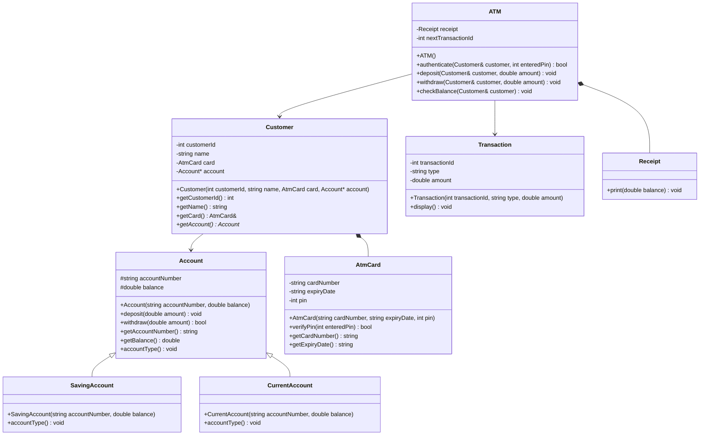

# ATM Card LLD Design

This folder contains a simple Low Level Design implementation for an ATM card based banking flow in C++.

The goal is to practice object-oriented design concepts such as abstraction, inheritance, composition, association, encapsulation, and polymorphism.

## Problem Statement

Design a basic ATM system where a customer can authenticate using an ATM card and perform banking operations such as:

- Check account balance
- Deposit money
- Withdraw money
- Generate transaction receipt

## Requirements

- A customer owns one ATM card.
- A customer is linked with one bank account.
- An ATM card should validate the entered PIN.
- An account should support deposit and withdraw operations.
- Different account types should be supported.
- A transaction should be created after a successful deposit or withdrawal.
- A receipt should show the available balance after each successful transaction.

## Main Classes

### Account

Abstract base class for all bank accounts.

Responsibilities:

- Store account number and balance
- Deposit money
- Withdraw money
- Return account balance
- Force child classes to define account type

### SavingAccount

Concrete account type that inherits from `Account`.

Responsibilities:

- Represents a saving account
- Implements `accountType()`

### CurrentAccount

Concrete account type that inherits from `Account`.

Responsibilities:

- Represents a current account
- Implements `accountType()`

### AtmCard

Represents the ATM card used by a customer.

Responsibilities:

- Store card number, expiry date, and PIN
- Verify entered PIN

### Customer

Represents the bank customer.

Responsibilities:

- Store customer details
- Hold an ATM card
- Link to an account

### Transaction

Represents a deposit or withdrawal transaction.

Responsibilities:

- Store transaction id, transaction type, and amount
- Display transaction details

### Receipt

Represents the receipt printed by the ATM.

Responsibilities:

- Print available balance after a transaction

### ATM

Main service class that coordinates card authentication and account operations.

Responsibilities:

- Authenticate customer PIN
- Deposit money
- Withdraw money
- Check balance
- Create transactions
- Print receipts

## UML Class Diagram



## Relationships Used

- Inheritance: `SavingAccount` and `CurrentAccount` inherit from `Account`.
- Composition: `Customer` owns an `AtmCard`.
- Association: `Customer` is linked with an `Account`.
- Composition: `ATM` owns a `Receipt`.
- Dependency: `ATM` creates `Transaction` objects while processing operations.
- Polymorphism: `ATM` works with the base `Account` pointer, so different account types can be used.

## Flow

1. Create an account.
2. Create an ATM card.
3. Create a customer and link the card and account.
4. ATM authenticates the customer using card PIN.
5. Customer can check balance, deposit, or withdraw.
6. ATM creates a transaction for successful deposit or withdrawal.
7. ATM prints a receipt with the updated balance.

## How To Run

From this example folder:

```powershell
cd "C:\Users\Asus\OneDrive\Desktop\System Design\Examples\AtmCard"
g++ -std=c++17 -Wall -Wextra atm_card.cpp -o atm_card.exe
./atm_card.exe
```

## Sample Output

```text
Authentication Successful

Account Number : ACC1001
Customer Name : Alok
Balance : 5000
Deposited : 1000

Transaction Id : 1
Type : Deposit
Amount : 1000
------ RECEIPT ------
Available Balance : 6000
---------------------
Withdrawn : 2000

Transaction Id : 2
Type : Withdraw
Amount : 2000
------ RECEIPT ------
Available Balance : 4000
---------------------

Account Number : ACC1001
Customer Name : Alok
Balance : 4000
```
